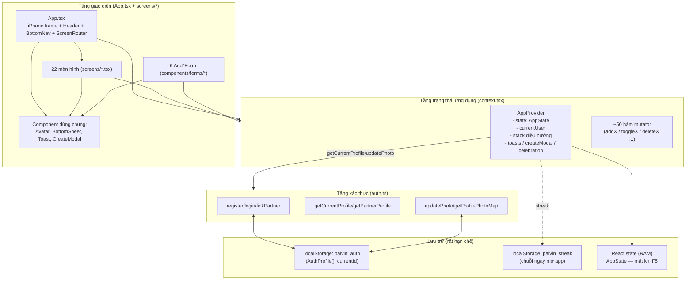

# SDS — Software Design Specification
## Ứng dụng PALVIN (Alvin ❤️ Paoi)

| | |
|---|---|
| **Phiên bản tài liệu** | 1.0 |
| **Ngày tạo** | 2026-08-28 |
| **Nguồn** | Reverse-engineered từ mã nguồn frontend hiện có (`frontend/src`) |
| **Tài liệu liên quan** | `docs/SRS.md` (yêu cầu chức năng/phi chức năng tương ứng) |

> Tài liệu này mô tả **thiết kế thực tế đang tồn tại trong code**, không phải thiết kế lý tưởng hoá. Các điểm bất cập kiến trúc (nợ kỹ thuật) được ghi nhận riêng ở Chương 10 để phân biệt với thiết kế "nên theo" khi tái cấu trúc.

---

## 1. Giới thiệu

### 1.1 Mục đích
Đặc tả kiến trúc phần mềm, mô hình dữ liệu, thiết kế module/component, thuật toán nghiệp vụ và hệ thống giao diện của PALVIN, làm cơ sở bảo trì, mở rộng, và thiết kế backend trong tương lai.

### 1.2 Phạm vi
Bao phủ toàn bộ `frontend/src`: app shell, hệ thống điều hướng, state management (Context API), 22 màn hình, 6 form tạo nội dung, 4 component dùng chung, và module xác thực độc lập (`auth.ts`).

---

## 2. Kiến trúc tổng quan

### 2.1 Kiểu kiến trúc
- **Single Page Application (SPA), client-only**, không có tầng backend/API thật (thư mục `backend/` rỗng).
- Toàn bộ trạng thái nghiệp vụ được quản lý bởi **1 React Context duy nhất** (`AppProvider` trong `context.tsx`), đóng vai trò tương đương một "store" (giống Redux nhưng không dùng reducer/action-type chuẩn — mỗi hành động là 1 hàm cập nhật `setState` trực tiếp).
- Không có routing thật (không dùng React Router / URL) — điều hướng mô phỏng bằng **ngăn xếp (stack) tự viết** lưu trong `useState`.
- Giao diện được bọc trong một khung mô phỏng thiết bị iPhone (kích thước cố định 393×852px) — đây là chế độ xem trước (preview shell) của Figma Make, không phải app shell responsive thật.

### 2.2 Sơ đồ khối tổng thể



### 2.3 Ngăn xếp công nghệ

| Lớp | Công nghệ | Ghi chú |
|---|---|---|
| UI Framework | React 19 + TypeScript 5.7 | Dùng function component + hooks thuần, không thư viện state ngoài |
| Build tool | Vite 8 + `@vitejs/plugin-react` | Alias `@` → `src` |
| Styling | Tailwind CSS v4 (`@tailwindcss/vite`) + inline style object trong JSX | Phần lớn màn hình dùng inline `style={{...}}` trực tiếp thay vì class Tailwind |
| State management | React Context + `useState` (custom, không Redux/Zustand) | 1 Context toàn cục duy nhất (`Ctx`) |
| Routing | Không dùng React Router — tự viết stack điều hướng (`navigate/goBack`) | Xem Chương 3 |
| Persistence | `localStorage` (chỉ auth + streak) | Không IndexedDB, không backend |
| Formatter | `oxfmt` | |
| Icon | SVG inline tự vẽ (không thư viện icon) | |

### 2.4 Cấu trúc thư mục chính

```
frontend/src/
├── App.tsx                # App shell: iPhone frame, header, bottom nav, ScreenRouter
├── context.tsx             # AppProvider — toàn bộ state + action toàn cục
├── types.ts                 # Định nghĩa toàn bộ kiểu dữ liệu (AppState + các entity)
├── data.ts                  # Seed data khởi tạo + hàm tính ngày yêu nhau
├── auth.ts                  # Hệ thống tài khoản độc lập (localStorage)
├── components/
│   ├── Avatar.tsx            # Avatar dùng chung (ảnh hoặc initials)
│   ├── BottomSheet.tsx        # Shell modal/bottom-sheet dùng chung
│   ├── CreateModal.tsx        # Modal "+" — router nội bộ 6 loại nội dung
│   ├── Toast.tsx              # Toast container toàn cục
│   └── forms/
│       ├── AddPostForm.tsx
│       ├── AddMemoryForm.tsx
│       ├── AddLoveNoteForm.tsx
│       ├── AddExpenseForm.tsx
│       ├── AddEventForm.tsx
│       └── AddGoalForm.tsx
└── screens/                  # 22 màn hình (chi tiết Chương 3.5 & Chương 5.3)
```

---

## 3. Kiến trúc điều hướng

Đây là phần **phức tạp và có vấn đề thiết kế nhất** của hệ thống — tồn tại song song **2 cơ chế điều hướng độc lập**.

### 3.1 Ngăn xếp điều hướng toàn cục (Global Screen Stack)
Định nghĩa trong `context.tsx`:
```ts
const [stack, setStack] = useState<{ screen: string; id?: string }[]>([{ screen: 'home' }]);
const navigate = (s, id) => setStack(prev => [...prev, { screen: s, id }]);
const goBack = () => setStack(prev => prev.length > 1 ? prev.slice(0, -1) : prev);
```
- `screen` hiện tại = phần tử cuối stack; `selectedId` = `id` của phần tử đó (dùng để tra cứu bản ghi, VD `memory-detail`).
- Không có giới hạn độ sâu, không loại bỏ trùng lặp — có thể push cùng 1 `screen` nhiều lần liên tiếp (VD Home → Calendar → Home → Calendar... vẫn hợp lệ, mỗi lần thêm 1 frame).
- Không đồng bộ với URL trình duyệt — nút Back vật lý của trình duyệt **không hoạt động** với ngăn xếp này (không dùng `history.pushState`).

`App.tsx`'s `ScreenRouter` là 1 `switch` thuần map `screen` → component:

| `screen` key | Component render | Ghi chú |
|---|---|---|
| `home` (mặc định) | `<Home/>` | |
| `feed` | `<Feed/>` | |
| `money` | `<Money/>` | |
| `us` | `<Us/>` | Chứa router cục bộ thứ 2, xem §3.3 |
| `memories` | `<Memories/>` | |
| `love-notes` | `<LoveNotes/>` | |
| `calendar` | `<Calendar/>` | |
| `future-us` | `<FutureUs/>` | |
| `search` | `<Search/>` | |
| `notifications` | `<Notifications/>` | |
| `settings` | `<Settings/>` | |
| `stats` | `<Money/>` | **Không** render `MonthlyStats` |
| `post-detail` | `<PostDetail/>` | Cần `selectedId` |
| `memory-detail` | `<MemoryDetail/>` | Cần `selectedId` |

→ `MonthlyStats.tsx` được `import` ở đầu `App.tsx` nhưng **không xuất hiện trong bất kỳ nhánh `switch` nào** → dead code đã import (xem Chương 10).

### 3.2 Bottom Tab & Header (App.tsx)
- 5 tab chính cố định (`MAIN_TABS = ['home','feed','stats','us','settings']`), tab thứ 5 hiển thị Avatar thay icon.
- Header hiển thị nút back `‹` khi `screen` không thuộc `MAIN_TABS` và khác `'home'` (biến `isSubScreen`).
- Nút search/notification trong header luôn gọi `navigate('search')` / `navigate('notifications')` — có mặt ở **mọi màn hình**, không phụ thuộc tab hiện tại.

### 3.3 Hệ thống điều hướng cục bộ thứ hai — bên trong `Us.tsx`
`Us.tsx` triển khai router riêng của nó, **hoàn toàn tách biệt** khỏi `navigate/goBack` toàn cục:
```ts
type SubScreen = 'main' | 'story' | 'favorites' | 'places' | 'future' | 'calendar'
  | 'trips' | 'capsule' | 'playlist' | 'collage' | 'wishjar' | 'dateidea' | 'gratitude' | 'permit';
const [sub, setSub] = useState<SubScreen>('main');
```
- Chuyển màn hình con bằng `setSub(key)`, quay lại bằng `setSub('main')` qua nút "← Back" **tự vẽ riêng ở từng màn con** — không đi qua `goBack()` toàn cục.
- Hệ quả: khi người dùng đang ở sâu trong 1 mini-feature của Us (VD Trip Planner), biến `screen` toàn cục **vẫn là `'us'`**, nên header app-level không hiển thị nút `‹` (vì `isSubScreen` tính dựa trên `screen`, không phải `sub`). Người dùng chỉ thoát được bằng nút back cục bộ bên trong màn hình con đó.
- Tải lại trang (F5) luôn đưa `sub` về `'main'` — không thể sâu-link (deep link) tới 1 mini-feature cụ thể của Us.
- 4 màn hình (`FutureUs`, `Calendar`, `TripPlanner`, `TimeCapsule`) được **dùng lại (re-use)** cả ở đây lẫn ở ScreenRouter toàn cục → 2 đường dẫn khác nhau tới cùng 1 component, nhưng không đồng bộ trạng thái điều hướng.

**➡ Khuyến nghị thiết kế lại (không nằm trong phạm vi bản hiện tại):** hợp nhất `sub` vào ngăn xếp toàn cục bằng cách thêm các `screen` key tương ứng (VD `'us-trips'`, `'us-wishjar'`...) vào `ScreenRouter`, loại bỏ hoàn toàn router cục bộ trong `Us.tsx`.

### 3.4 Hệ thống Modal/Overlay ("Create" flow)
Độc lập với cả 2 hệ thống trên — dùng cờ boolean rời:
```ts
const [createModal, setCreateModal] = useState(false); // context.tsx
```
- `openCreate()`/`closeCreate()` bật/tắt modal "+" (`CreateModal.tsx`).
- Bên trong `CreateModal`, lựa chọn loại nội dung được quản lý bằng `step` cục bộ (`useState<string|null>`), không phải AppState — chọn 1 trong 6 loại sẽ swap sang `Add*Form` tương ứng; đóng form (`onClose`) luôn gọi `closeCreate()` (thoát hẳn), **không có đường quay lại menu 6 lựa chọn**.
- `BottomSheet.tsx` là shell dùng chung (overlay click / Escape / nút ✕) cho `CreateModal` và toàn bộ `Add*Form`, nhưng **không phải mọi modal trong app đều dùng nó** — `Home.tsx` (mood picker, add-countdown) và `Money.tsx` (add-bill) tự vẽ overlay riêng, dẫn đến hành vi đóng modal (đặc biệt phím Escape) không đồng nhất toàn ứng dụng.

### 3.5 Bảng tổng hợp khả năng truy cập màn hình

| Màn hình | Global ScreenRouter | Us.tsx sub-nav | Trạng thái truy cập |
|---|---|---|---|
| Home, Feed, Money, Us, Settings | ✅ (tab chính) | — | Luôn truy cập được |
| PostDetail, MemoryDetail, Search, Notifications | ✅ | — | Truy cập được qua điều hướng |
| Memories, LoveNotes, Calendar, FutureUs | ✅ | Calendar & FutureUs cũng có ở Us | Truy cập được (đôi khi 2 đường) |
| TripPlanner, TimeCapsule, DateIdeaJar, GratitudeJournal, DatePermit | ❌ | ✅ | Chỉ qua Us → menu |
| MonthlyStats | ❌ (import chết) | ❌ | **Không thể truy cập** |
| CoupleTrivia | ❌ | ❌ (không có trong `SubScreen`) | **Không thể truy cập** |
| MoodTracker | ❌ | ❌ (không có trong `SubScreen`) | **Không thể truy cập** (dữ liệu nền vẫn dùng ở Home) |

---

## 4. Thiết kế dữ liệu (Data Design)

### 4.1 Mô hình AppState tổng thể

```mermaid
classDiagram
    class AppState {
        Post[] posts
        Memory[] memories
        Expense[] expenses
        SavingsGoal[] savingsGoals
        Bill[] bills
        LoveNote[] loveNotes
        SecretNote[] secretNotes
        LoveLetter[] loveLetters
        CalendarEvent[] events
        Goal[] goals
        AppNotification[] notifications
        moods
        MoodEntry[] moodHistory
        favorites
        Place[] places
        Trip[] trips
        Capsule[] capsules
        Countdown[] countdowns
        PlaylistItem[] playlist
        loveLanguages
        WishItem[] wishes
        BucketItem[] bucketList
        hugs[]
        GratitudeEntry[] gratitude
        DateRequest[] dateRequests
        DateIdea[] dateIdeas
        postReactions
        boolean darkMode
        favPlaces
    }
    class Post { string id; User author; string date; string image; string caption; number likes; boolean liked; boolean saved; Comment[] comments; string location }
    class Memory { string id; string title; string date; number year; string location; string description; string image; boolean favorite; User[] people }
    class Expense { string id; string title; string category; string amount; User~Both paidBy; string date; string note; type }
    class Bill { string id; string title; category; number amount; number dueDay; boolean paid; boolean reminder }
    class SavingsGoal { string id; string title; number current; number target; string deadline }
    class LoveNote { string id; User from; User to; string message; string mood; boolean read }
    class CalendarEvent { string id; string title; string date; string time; category; string location }
    class Goal { string id; string title; boolean completed; string completedDate }
    class Trip { string id; string title; string destination; number budget; number spent; checklist[]; status }
    class Capsule { string id; User from; to; string message; string unlockDate; boolean opened }
    class DateRequest { string id; User from; to; string activity; status }
    AppState "1" o-- "*" Post
    AppState "1" o-- "*" Memory
    AppState "1" o-- "*" Expense
    AppState "1" o-- "*" Bill
    AppState "1" o-- "*" SavingsGoal
    AppState "1" o-- "*" LoveNote
    AppState "1" o-- "*" CalendarEvent
    AppState "1" o-- "*" Goal
    AppState "1" o-- "*" Trip
    AppState "1" o-- "*" Capsule
    AppState "1" o-- "*" DateRequest
```



> `AppState` không có khoá ngoại/quan hệ thực sự giữa các mảng (không phải CSDL quan hệ) — liên kết duy nhất là `Place.memoryIds: string[]` tham chiếu tới `Memory.id` (dùng ở "Our Places").

### 4.2 Chi tiết entity chính (tóm tắt trường quan trọng — xem `types.ts` để đầy đủ)

| Entity | Trường khoá | Ràng buộc quan trọng |
|---|---|---|
| `Post` | `author: 'Alvin'\|'Paoi'` | `comments[]` nhúng trực tiếp (không chuẩn hoá bảng riêng) |
| `Memory` | `year: number`, `people: User[]` | `people` trên thực tế luôn `['Alvin','Paoi']` do form ép cứng |
| `Expense` | `paidBy: User \| 'Both'`, `type?: 'expense'\|'income'` | `type` optional — không có giá trị = coi như expense |
| `Bill` | `category: 'rent'\|'utilities'\|'internet'\|'subscription'\|'other'`, `dueDay: 1–31` | Không có trường "tháng áp dụng" — hoá đơn lặp lại vô hạn theo `dueDay` mỗi tháng |
| `SavingsGoal` | `current`, `target` | `current` luôn bị chặn `≤ target` khi cập nhật qua `addToGoal` |
| `LoveNote`/`LoveLetter`/`SecretNote` | `from/to: User` | `SecretNote` không có `read`/mutator — chỉ đọc |
| `CalendarEvent` | `category` union 5 giá trị | Không hỗ trợ lặp lại định kỳ |
| `Goal` (Future Us) | `completed`, `completedDate?` | Khác biệt hoàn toàn với `SavingsGoal` — 2 khái niệm "goal" riêng |
| `Trip` | `status: 'planning'\|'upcoming'\|'completed'` | Không có cơ chế UI chuyển trạng thái sau khi tạo |
| `Capsule` | `to: 'Alvin'\|'Paoi'\|'both'` | Khác kiểu `User` chuẩn (thêm giá trị `'both'`) |
| `DateRequest` | `status: 'pending'\|'approved'\|'rejected'` | |
| `WishItem` | có field `price?`/`link?` được dùng qua ép kiểu `as any` trong `Us.tsx` (không khai báo chính thức trong `types.ts`) |
| `BucketItem`, `LoveLanguageResult`, `DateIdea` | Có type đầy đủ + (`BucketItem`/`LoveLanguageResult`) có action CRUD trong context | **Không có UI nào sử dụng** (orphaned — xem Chương 10) |

### 4.3 Nguồn dữ liệu khởi tạo (`data.ts`)
- `initialState: AppState` là **hằng số tĩnh**, được gán trực tiếp làm giá trị khởi tạo của `useState` trong `AppProvider`. Không có API fetch, không loading state, không lỗi mạng có thể xảy ra ở tầng dữ liệu.
- `RELATIONSHIP_START = new Date('2023-08-21')` — nguồn duy nhất **nên** dùng cho ngày kỷ niệm, nhưng thực tế bị lặp lại thủ công dưới dạng chuỗi hiển thị ở `Us.tsx` ("Together since August 21, 2023") và `Settings.tsx` ("Anniversary — August 21, 2023") — 3 nơi độc lập cho cùng 1 giá trị khái niệm (rủi ro lệch dữ liệu khi sửa).
- `getDaysTogether()` / `getDuration()` là 2 hàm thuần (pure function) duy nhất được export từ tầng dữ liệu, dùng lại ở cả `Home.tsx` và `Us.tsx`.

### 4.4 Lưu trữ tài khoản độc lập (`auth.ts`)
```ts
interface AuthProfile { id; displayName; password /* plaintext */; photoUrl?; linkCode; linkedToId?; linkedAt? }
interface AuthStore { profiles: AuthProfile[]; currentId: string | null }  // localStorage key: 'palvin_auth'
```
- Hoàn toàn tách biệt khỏi `AppState`/`context.tsx` — không import lẫn nhau ngoài 2 điểm nối: `context.tsx` gọi `authUpdatePhoto()`/`getProfilePhotoMap()` (đồng bộ ảnh đại diện), và `AuthScreen.tsx`/`Settings.tsx` gọi trực tiếp các hàm auth khác.
- Ràng buộc nghiệp vụ cứng trong tầng này (không phải UI): tối đa 2 `profiles`, tên hiển thị duy nhất (không phân biệt hoa/thường), liên kết (`linkPartner`) đối xứng 2 chiều và **không thể huỷ** (không có hàm `unlink`).
- **Không có hoá mật khẩu** — lưu trực tiếp field `password` dạng chuỗi thường trong `localStorage`.

### 4.5 Vấn đề nhất quán dữ liệu cần lưu ý khi thiết kế backend
1. `currentUser` (context, in-memory, mặc định `'Alvin'`) ≠ hồ sơ đăng nhập thật (`auth.ts`, persistent) — khi thiết kế lại cần hợp nhất thành 1 khái niệm "phiên đăng nhập" duy nhất.
2. Không có `updatedAt/createdAt` chuẩn hoá trên hầu hết entity — nhiều nơi dùng chuỗi hiển thị đã format sẵn (VD `Post.date = "August 25, 2026"`) thay vì ISO timestamp, gây khó sort/so sánh chính xác (đã thấy ảnh hưởng ở Search — sort theo string, ở Home — parse lại `new Date(displayString)`).
3. `id` sinh bằng bộ đếm cục bộ tăng dần trong bộ nhớ (`uid()` = `String(++idCounter)`, bắt đầu từ 1000) — **không đảm bảo duy nhất giữa các phiên** (mỗi lần tải lại trang, bộ đếm reset) → không dùng được làm khoá chính thật khi có backend.

---

## 5. Thiết kế Component / Module

### 5.1 App Shell (`App.tsx`)
Trách nhiệm: (1) bọc toàn bộ UI trong khung iPhone tĩnh, (2) vẽ status bar giả (giờ hệ thống thật, icon sóng/wifi/pin tĩnh), (3) header động theo `screen`, (4) `ScreenRouter`, (5) bottom nav 5 tab + nút "+", (6) mount `CreateModal`/`Toast` ở gốc.
- State cục bộ duy nhất: `authed` (luôn `true`, xem SRS FR-AUTH-05).
- Toàn bộ layout dùng inline style (không CSS module/class riêng cho phần lớn phần tử), khiến việc responsive hoá sau này tốn công sửa trực tiếp trong JSX.

### 5.2 Context Provider (`context.tsx`) — Bảng danh mục hành động (Action Catalogue)

`AppProvider` expose 1 object `AppContextType` gồm `state`, các cờ UI (`screen`, `selectedId`, `toasts`, `createModal`, `celebration`, `profilePhotos`) và **~48 hàm mutator**. Mỗi hàm theo mẫu chung: `setState(s => ({...s, <field>: <biến đổi bất biến>}))`, một số hàm còn đồng thời chèn thêm 1 `AppNotification` và/hoặc gọi `toast()`.

| Domain | Hàm | Field bị thay đổi | Side-effect kèm theo |
|---|---|---|---|
| Post | `toggleLike`, `toggleSave`, `addComment`, `addPost` | `posts` | `addPost` → thêm `notifications` + toast |
| Memory | `addMemory`, `toggleFavorite` | `memories` | `addMemory` → thêm `notifications` + toast |
| Expense | `addExpense`, `deleteExpense` | `expenses` | toast |
| Savings | `addSavingsGoal`, `addToGoal` | `savingsGoals` | `addToGoal` chặn trần `target`; toast |
| Love Note | `addLoveNote`, `markNoteRead` | `loveNotes` | `addLoveNote` → thêm `notifications` + toast |
| Event | `addEvent`, `deleteEvent` | `events` | toast (chỉ khi add) |
| Goal (Future Us) | `addGoal`, `toggleGoal`, `deleteGoal` | `goals` | `toggleGoal` → `celebration` 2s + toast khi hoàn thành |
| Mood | `setMood` | `moods`, `moodHistory` | toast |
| Favorites | `updateFavorite` | `favorites` | toast |
| Notification | `markNotifRead`, `markAllRead` | `notifications` | — |
| Bill | `addBill`, `toggleBillPaid`, `deleteBill`, `toggleBillReminder` | `bills` | toast (VN) khi add/delete |
| Trip | `addTrip`, `updateTrip`, `deleteTrip`, `toggleTripCheck` | `trips` | toast khi add/delete |
| Capsule | `addCapsule`, `openCapsule` | `capsules` | toast khi add |
| Countdown | `addCountdown`, `deleteCountdown` | `countdowns` | toast khi add |
| Playlist | `addToPlaylist`, `removeFromPlaylist` | `playlist` | toast khi add |
| Love Language | `saveLoveLanguage` | `loveLanguages` | toast — **không hàm nào gọi tới trong UI** |
| Wish | `addWish`, `drawWish`, `removeWish` | `wishes` | toast khi add |
| Bucket List | `addBucketItem`, `toggleBucketItem`, `deleteBucketItem` | `bucketList` | `toggleBucketItem` → celebration + toast — **không màn hình nào gọi các hàm này** |
| Love Letter | `addLoveLetter`, `deleteLoveLetter` | `loveLetters` | `addLoveLetter` → thêm `notifications` + toast (VN) |
| Hug | `sendHug` | `hugs` | thêm `notifications` + toast (VN) |
| Date Request | `submitDateRequest`, `respondToRequest` | `dateRequests` | thêm `notifications` + toast (VN) cho cả 2 hàm |
| Gratitude | `addGratitude` | `gratitude` | toast (VN) |
| Reaction | `addReaction` | `postReactions` | — |
| Fav Place | `addFavPlace`, `removeFavPlace` | `favPlaces` | toast (VN) khi add |
| Dark mode | `toggleDarkMode` | `darkMode` | Gán/gỡ `data-theme` DOM attribute |
| Profile photo | `updateProfilePhoto` | (uỷ quyền `auth.ts`) → `profilePhotos` | toast (VN) |
| Điều hướng | `navigate`, `goBack` | `stack` | — |
| User | `switchUser` | `currentUser` | toast |

**Nhận xét thiết kế:** đây thực chất là một "reducer thủ công" trải phẳng thành nhiều hàm riêng lẻ thay vì 1 hàm `dispatch(action)` tập trung — dễ đọc với quy mô hiện tại (~50 hàm) nhưng sẽ khó mở rộng/kiểm thử nếu tăng thêm nhiều domain nữa. Không có hàm nào cho `secretNotes`, `places`, `dateIdeas` (đúng như phát hiện ở SRS §7).

### 5.3 Danh mục 22 màn hình (`screens/*.tsx`)

| Màn hình | Vai trò | State cục bộ đáng chú ý | Ghi chú thiết kế |
|---|---|---|---|
| `Home.tsx` | Dashboard tổng hợp | `picks` (gợi ý ngẫu nhiên), `hugAnim/thinkAnim`, `showMoodPicker`, `showAddCountdown`, `vinylIdx` | Nhiều widget độc lập trên 1 màn hình — ứng viên tách nhỏ thành sub-component |
| `Feed.tsx` | Bảng tin ảnh | `commentingId`, `reactionPickerId`, `likedAnim` | `showAddPost`/`AddPostForm` import nhưng chết (không có nút gọi) |
| `PostDetail.tsx` | Chi tiết 1 post | `text` (comment input) | `return null` khi không tìm thấy post |
| `Memories.tsx` | Lưới memory + filter năm | `filter`, `showAdd` | |
| `MemoryDetail.tsx` | Chi tiết 1 memory | — | `return null` khi không tìm thấy |
| `Money.tsx` | Hub tài chính 4 tab | `tab`, `showAddExpense`, `showAddBill`, state riêng từng tab con | Định nghĩa `AddBillForm` inline (không tách file) |
| `MonthlyStats.tsx` | Thống kê chi tiêu (bản trùng) | — | **Orphaned**, đơn vị USD, không lọc income |
| `LoveNotes.tsx` | 3 tab Notes/Letters/Secret | `tab`, `openLetter`, `LetterComposer` state | Chứa 2 component con `LetterReader`/`LetterComposer` |
| `Calendar.tsx` | Lịch tháng | `month`, `year`, `selected` | Tái sử dụng ở cả ScreenRouter và Us |
| `FutureUs.tsx` | Bucket-list "Goal" | `showAdd` | Đọc cờ `celebration` toàn cục |
| `Us.tsx` | Hub + router cục bộ 13 mục | `sub` (xem §3.3) | File lớn nhất về số sub-component nội bộ (7+ component con định nghĩa ngay trong file) |
| `Search.tsx` | Tìm kiếm toàn cục | `query` | Thuần đọc, không mutate AppState |
| `Notifications.tsx` | Danh sách thông báo | — | |
| `Settings.tsx` | Hồ sơ & cài đặt | `notifications` (cục bộ, không liên quan AppState), `showLogout` | Nhiều nút chỉ toast (stub) |
| `AuthScreen.tsx` | Welcome/Register/Login/Link | `flow`, form fields | **Không được mount trong luồng thực tế** (App.tsx `authed` luôn true) |
| `CoupleTrivia.tsx` | Quiz đố vui | `phase`, `answers` | **Orphaned**, không dùng context |
| `DateIdeaJar.tsx` | Quay hũ ý tưởng hẹn hò | `customIdeas`, `history`, `picked` | Không dùng `AppState.dateIdeas` |
| `DatePermit.tsx` | Đơn xin phép | `tab`, form fields | |
| `GratitudeJournal.tsx` | Nhật ký biết ơn | `text`, `filter` | |
| `MoodTracker.tsx` | Theo dõi cảm xúc (bản riêng) | `tab`, `picking` | **Orphaned**, dù dùng chung `state.moods/moodHistory/setMood` với Home |
| `TimeCapsule.tsx` | Thư gửi tương lai | `showAdd` | |
| `TripPlanner.tsx` | Danh sách + chi tiết chuyến đi | `selected` (id trip đang xem) | Chứa `AddTripForm`/`TripDetail` nội bộ |

### 5.4 Component dùng chung

| Component | Trách nhiệm | Props |
|---|---|---|
| `Avatar.tsx` | Vẽ avatar tròn (ảnh hoặc chữ cái đầu tên), style riêng cho Alvin (gradient hồng đậm) và Paoi (gradient hồng nhạt) | `user, size?, ring?, story?, photoUrl?, onClick?` |
| `BottomSheet.tsx` | Shell modal trượt lên — overlay, drag handle, header có ✕, đóng bằng Escape | `onClose, title?, children` |
| `Toast.tsx` (`ToastContainer`) | Hiển thị danh sách toast nổi, tự ẩn (điều khiển bởi `context.tsx`) | `toasts` (từ context) |
| `CreateModal.tsx` | Router nội bộ 6 loại nội dung tạo mới | Không props ngoài (đọc `closeCreate` từ context) |

### 5.5 Khuôn mẫu thiết kế chung của `Add*Form`

Cả 6 form (`AddPostForm`, `AddMemoryForm`, `AddLoveNoteForm`, `AddExpenseForm`, `AddEventForm`, `AddGoalForm`) tuân theo đúng 1 khuôn mẫu — nên được chính thức hoá thành 1 "contract" khi tái cấu trúc:

```
1. useState riêng cho từng field + 1 state `error: string` dùng chung (không validate theo từng field).
2. handleSubmit(): kiểm tra tuần tự từng rule bắt buộc, return sớm + setError ở rule đầu tiên fail.
3. Nếu qua hết validate: gọi đúng 1 hàm add*() từ context, rồi gọi onClose().
4. Không gọi API — mọi thứ đồng bộ, không có trạng thái loading/pending.
5. Ảnh minh hoạ luôn chọn từ 1 mảng URL Unsplash cố định (5 ảnh) — không có upload file thật.
```

---

## 6. Thiết kế thuật toán & công thức nghiệp vụ

Toàn bộ công thức dưới đây được trích trực tiếp (verbatim) từ mã nguồn.

### 6.1 Số ngày & thời lượng mối quan hệ (`data.ts`)
```ts
RELATIONSHIP_START = new Date('2023-08-21')
getDaysTogether() = floor((now - RELATIONSHIP_START) / 86400000)
getDuration(): { years, months, days }  // borrow ngày từ tháng trước nếu day<0, borrow năm nếu months<0
```

### 6.2 Streak mở app (`Home.tsx`, `localStorage['palvin_streak']`)
```
if lastDate === today        → giữ nguyên streak
else if lastDate === yesterday → streak += 1
else                           → streak = 1
```
Chỉ tính khi mở màn hình Home, không phản ánh mức độ tương tác thật.

### 6.3 Đếm ngược ngày (`daysUntil`, dùng ở Home/TripPlanner/TimeCapsule dưới các biến thể tên khác nhau)
```ts
Math.ceil((new Date(dateStr) - new Date().setHours(0,0,0,0)) / 86400000)
```

### 6.4 Công thức bù trừ chi phí (Settlement — dùng ở cả `Money.tsx` và `MonthlyStats.tsx`)
```ts
diff    = Math.abs(alvinTotal - paoiTotal)
whoOwes = alvinTotal > paoiTotal ? 'Paoi' : 'Alvin'
owedTo  = alvinTotal > paoiTotal ? 'Alvin' : 'Paoi'
amountToSettle = diff / 2   // chia đôi phần chênh lệch để cân bằng đóng góp 50/50
// chỉ hiển thị nếu diff > 0.01
```

### 6.5 Định dạng tiền tệ
```ts
// Money.tsx & TripPlanner.tsx (VNĐ)
VND(n) = n>=1_000_000 ? `${(n/1e6).toFixed(1)}M ₫`
       : n>=1000      ? `${(n/1000).toFixed(0)}K ₫`
       : `${n} ₫`

// MonthlyStats.tsx & AddExpenseForm.tsx (USD) — không đồng bộ với trên
`$${amount.toFixed(2)}`
```

### 6.6 Tiến độ quỹ tiết kiệm & mục tiêu
```ts
addToGoal: current = Math.min(current + amount, target)      // context.tsx — chặn trần cứng
percent   = Math.round((current / target) * 100)               // hiển thị màu xanh nếu >= 100
progressFutureUs = Math.round((completed.length / goals.length) * 100)
```

### 6.7 Trạng thái hạn hoá đơn (`Money.tsx getDueStatus`) — có lỗi biên
```
if isPaid            → "Đã trả"
daysLeft = dueDay - ngày_hiện_tại_trong_tháng
if daysLeft < 0       → "Quá hạn"     // ⚠ không kiểm tra lật sang tháng mới
else if daysLeft <= 3 → "{daysLeft}d"
else                  → "Ngày {dueDay}"
```

### 6.8 Biểu đồ tâm trạng 7 ngày (`Home.tsx`)
```
MOOD_SCORE: 😍/🥰 = 5, 😊 = 4, 😐 = 3, 🥺/😭/😴 = 2, 😤 = 1, mặc định 3
barHeight% = (score / 5) * 100        // ngày không có dữ liệu → bar 8% opacity 0.2
```

### 6.9 Độ tương thích tâm trạng (`MoodTracker.tsx` — orphaned nhưng vẫn nên ghi nhận thiết kế)
```
diff = |myScore - partnerScore|
compat = diff==0 ? 100 : diff==1 ? 85 : diff==2 ? 65 : diff==3 ? 45 : 30
```

### 6.10 Tìm kiếm toàn cục (`Search.tsx`)
So khớp chuỗi con không phân biệt hoa/thường (`field.toLowerCase().includes(q)`) trên từng entity, nối kết quả theo thứ tự cố định: Post → Memory → LoveNote → SavingsGoal → Event → Place. Không chấm điểm liên quan (relevance scoring), không debounce.

### 6.11 Toggle cảm xúc bài viết (`addReaction`, `context.tsx`)
```ts
reacted = existing?.reacted ?? false
newCount = reacted ? existing.count - 1 : (existing?.count ?? 0) + 1
```
"Top 3 reactions" ở Feed thực chất là 3 mục đầu tiên có `count>0` theo thứ tự khai báo object, **không sắp xếp theo số lượng**.

### 6.12 Gom nhóm ảnh theo tháng — Photo Collage (`Us.tsx`)
```ts
key = `${year}-${String(month+1).padStart(2,'0')}`   // từ Date(memory.date)
months = Object.keys(byMonth).sort((a,b) => b.localeCompare(a))  // mới nhất trước
grid4 = mems.slice(0,4); rest = mems.length - 4       // huy hiệu "+N" nếu > 4
```

### 6.13 Trạng thái mở khoá theo thời gian (Secret Note / Time Capsule)
```ts
isUnlocked = note.unlockDate <= today   // so sánh chuỗi ISO yyyy-mm-dd
```
Không có ràng buộc chặn chọn ngày trong quá khứ khi tạo (Time Capsule) → có thể tạo 1 "thư tương lai" mở khoá ngay lập tức.

### 6.14 Điểm số Couple Trivia (orphaned, vẫn ghi nhận)
```ts
score = answers.filter((a,i) => a === QUESTIONS[i].answer).length
pct = Math.round(score / total * 100)
progress_hiển_thị = (current / total) * 100   // ⚠ lệch 1 câu — dùng current thay vì current+1
```

---

## 7. Thiết kế giao diện (Design System)

### 7.1 Bảng màu (theo brief gốc, áp dụng xuyên suốt qua CSS variable `var(--...)`)

| Token | Mã màu | Vai trò |
|---|---|---|
| Background | `#FFF8FA` | Nền toàn app |
| Sakura chính | `#F3A6B9` | Nhấn chính |
| Sakura nhạt | `#FADCE4` | Nền phụ, badge |
| Accent Pink | `#E67F9A` | Nút hành động |
| Deep Pink | `#C95F7C` | Nhấn mạnh/active state |
| Text chính | `#332A2D` | |
| Text phụ | `#8C7A80` | |
| Trắng | `#FFFFFF` | Card nền |

### 7.2 Bố cục khung thiết bị (App Shell hiện tại)
- Khung iPhone tĩnh 393×852px, bo góc 54px, mô phỏng notch/Dynamic Island, status bar giả (giờ thật + icon sóng/wifi/pin tĩnh).
- Header cao 56 (status bar) + phần header nội dung (~52px), main content cuộn dọc (`overflow-y:auto`, padding-bottom 80px chừa chỗ bottom nav), bottom nav cao ~68px cố định `position:absolute`.
- **Không có breakpoint desktop thực sự** — trái với yêu cầu brief gốc (mobile 390px / desktop 1440px với sidebar trái). Đây là hạn chế responsive lớn nhất cần xử lý khi chuyển sang sản phẩm thật.

### 7.3 Kiểu chữ
- Heading lãng mạn: `'DM Serif Display', serif` (VD chữ "PALVIN", tiêu đề memory).
- Phần còn lại: sans-serif hệ thống mặc định.

### 7.4 Mẫu tương tác lặp lại
- Toast pill tối màu, top-center, tự ẩn 3s.
- Bottom sheet trượt lên, bo góc trên, drag-handle.
- Progress bar 2 lớp (nền nhạt + fill gradient), dùng ở Savings Goal, Future Us, Trip Budget/Checklist.
- Badge trạng thái dạng pill màu theo ngữ cảnh (Trip status, Bill due status, Date Permit stamp).
- Card hover: đổi border/background qua xử lý DOM trực tiếp (`onMouseEnter/onMouseLeave`) ở một số nơi (Memories) thay vì CSS `:hover` — không nhất quán với các nơi dùng CSS thuần.

---

## 8. Xử lý lỗi, Validate & Trạng thái rỗng

### 8.1 Chiến lược validate hiện tại
- **Không có validate tập trung/schema** (không Zod/Yup) — mỗi form tự viết chuỗi `if` tuần tự, dừng ở lỗi đầu tiên, hiển thị 1 dòng lỗi chung (không lỗi theo từng field).
- Một số form Vietnamese (Money.tsx's inline `AddBillForm`, Us.tsx's mini-forms) dùng kiểu **im lặng bỏ qua** (`if (!x) return;`) thay vì hiển thị thông báo lỗi — không nhất quán với các form tiếng Anh (luôn có `setError(...)`).
- Không có validate định dạng nâng cao (email, số điện thoại...) vì ứng dụng không cần các trường này.

### 8.2 Mẫu xử lý "not found"
- `PostDetail`/`MemoryDetail`: `if (!record) return null;` — không có màn hình lỗi/thông báo, cũng không tự động `goBack()`. **Nên chuẩn hoá** thành 1 component `NotFoundState` dùng chung khi tái cấu trúc.

### 8.3 Danh mục trạng thái rỗng (Empty States) đã cài đặt

| Màn hình | Thông điệp |
|---|---|
| Memories (theo filter) | "No memories yet" / "Let's create your first little memory." |
| Feed | Không có — danh sách trống hiển thị khoảng trắng, chưa có empty state |
| Search (chưa nhập) | "Search PALVIN" |
| Search (không kết quả) | 'No results for "{query}"' |
| Notifications | "No notifications" / "You're all caught up!" |
| Money — Expenses | "Chưa có giao dịch" |
| Money — Bills | "Chưa có hóa đơn" |
| Future Us | "No goals yet" / "What do you dream of doing together?" |
| LoveNotes — Notes | "No love notes yet" |
| LoveNotes — Letters | "Chưa có thư tình nào" |
| Trip Planner | "✈️ Chưa có chuyến đi nào" |
| Time Capsule | "Chưa có thư nào. Viết thư đầu tiên ngay!" |
| Gratitude Journal | "🌸 Chưa có ghi chép nào" |
| Date Permit (Inbox/Mine) | "📭/📝 Chưa có đơn nào" |
| MonthlyStats (orphaned) | "No expenses this month" |

### 8.4 Toast — cơ chế & lỗi đã biết
```ts
toast(msg, emoji='🌸') {
  push({id, message, emoji});
  clearTimeout(toastTimer.current);          // ⚠ chỉ 1 timer dùng chung cho toàn bộ hàng đợi toast
  toastTimer.current = setTimeout(() => filter theo id, 3000);
}
```
Khi 2 toast được tạo cách nhau < 3s, timer của toast đầu bị `clearTimeout` và ghi đè — chỉ toast cuối có lịch xoá đúng theo id của nó; nếu không có toast thứ 3 kích hoạt filter, toast trước có thể tồn đọng trên màn hình lâu hơn dự kiến. **Đề xuất fix:** dùng 1 timer riêng theo từng `id` toast (Map<id, timeoutHandle>) thay vì 1 ref dùng chung.

---

## 9. Bảo mật & Quyền riêng tư

| Vấn đề | Mô tả | Mức độ |
|---|---|---|
| Mật khẩu plaintext | `AuthProfile.password` lưu nguyên văn trong `localStorage`, không hash/salt | Cao (nếu triển khai thật) |
| Auth không gate ứng dụng | `authed` cứng `true`, không có access control thực tế nào bảo vệ dữ liệu | Cao |
| `switchUser` không cần xác thực | Bất kỳ ai mở app đều đổi được góc nhìn Alvin ↔ Paoi tự do | Trung bình (chấp nhận được vì app dùng chung 1 thiết bị/gia đình) |
| Dữ liệu 100% client-side | Không mã hoá tại rest, ai truy cập được thiết bị/trình duyệt đều đọc được toàn bộ nội dung riêng tư | Trung bình — phù hợp mô hình "chỉ 2 người, chạy local" hiện tại nhưng không phù hợp nếu public hoá |
| Không rate-limit/không kiểm tra input độ dài | Text area (love letter, comment...) không giới hạn ký tự tối đa | Thấp |

---

## 10. Nợ kỹ thuật & Vấn đề thiết kế (Technical Debt Catalog)

| # | Hạng mục | Vị trí | Mức ảnh hưởng |
|---|---|---|---|
| 1 | 3 màn hình orphaned hoàn toàn (`CoupleTrivia`, `MoodTracker`, `MonthlyStats`) | screens/ | Trung bình — code chết, tăng chi phí bảo trì |
| 2 | 2 domain dữ liệu orphaned (`bucketList`, `loveLanguages`) có đủ CRUD nhưng không UI | context.tsx, types.ts | Trung bình |
| 3 | `secretNotes`, `places`, `dateIdeas` không có action tạo/sửa/xoá dù có type & hiển thị | context.tsx | Trung bình |
| 4 | 2 hệ thống điều hướng song song không đồng bộ (global stack vs `Us.tsx` local `sub`) | App.tsx, Us.tsx | Cao — rủi ro khi thêm màn hình mới |
| 5 | 2 cách tính thống kê chi tiêu trùng lặp, khác đơn vị tiền tệ, khác logic lọc income | Money.tsx, MonthlyStats.tsx | Cao |
| 6 | Modal/bottom sheet triển khai không đồng nhất (dùng chung `BottomSheet` vs tự vẽ overlay riêng) | Home.tsx, Money.tsx, CreateModal.tsx | Trung bình |
| 7 | 3 nguồn dữ liệu độc lập cho cùng ngày kỷ niệm (`RELATIONSHIP_START` vs 2 chuỗi hardcode) | data.ts, Us.tsx, Settings.tsx | Trung bình |
| 8 | "Our Story" timeline hoàn toàn tách biệt khỏi `state.memories` thật | Us.tsx | Trung bình |
| 9 | Lỗi tính hạn hoá đơn không xử lý lật tháng | Money.tsx `getDueStatus` | Thấp–Trung bình |
| 10 | Toast dùng chung 1 timer, có thể để lại toast tồn đọng | context.tsx | Thấp |
| 11 | `id` sinh bằng bộ đếm bộ nhớ, không ổn định giữa các phiên | context.tsx `uid()` | Cao (khi ghép backend thật) |
| 12 | Không persistence cho AppState (mất khi F5) | context.tsx (`useState(initialState)`) | Cao (là lý do chính cần backend) |
| 13 | Ngôn ngữ UI lẫn lộn Việt/Anh không theo quy tắc rõ ràng | Toàn bộ codebase | Trung bình |
| 14 | Danh mục chi tiêu không đồng bộ giữa form nhập và bảng thống kê | AddExpenseForm.tsx, Money.tsx, MonthlyStats.tsx | Thấp |
| 15 | `WishItem.price/link` dùng ép kiểu `as any` — không khai báo chính thức trong `types.ts` | Us.tsx | Thấp |
| 16 | Nút xoá hoá đơn không có icon/nhãn hiển thị (nhưng vẫn bấm được) | Money.tsx `BillCard` | Thấp (UI bug) |
| 17 | Feed's `showAddPost`/`AddPostForm` import chết (không nút nào set true) | Feed.tsx | Thấp |
| 18 | App shell không responsive thật (khung iPhone cố định, không có desktop layout) | App.tsx | Cao (chặn phát hành sản phẩm thật) |

---

## 11. Đề xuất thiết kế Backend tương lai (định hướng, ngoài phạm vi hiện tại)

Vì `backend/` hiện rỗng, phần này phác thảo cách mapping `AppState` hiện tại sang mô hình server để nhóm phát triển tham khảo khi bắt đầu xây dựng backend thật.

### 11.1 Nguyên tắc chuyển đổi
- Mỗi mảng trong `AppState` (`posts`, `memories`, `expenses`, `bills`, `savingsGoals`, `loveNotes`, `secretNotes`, `loveLetters`, `events`, `goals`, `trips`, `capsules`, `countdowns`, `playlist`, `wishes`, `bucketList`, `gratitude`, `dateRequests`, `dateIdeas`, `places`) → 1 bảng CSDL riêng, khoá chính UUID thay cho `uid()` bộ đếm bộ nhớ.
- `notifications` nên trở thành bảng do server sinh ra (server-side event), không phải client tự chèn như hiện tại.
- Cần bảng `couples` (1 cặp = 1 workspace dữ liệu) để hỗ trợ nhiều cặp đôi dùng chung hệ thống trong tương lai — hiện `AppState` giả định chỉ có đúng 1 cặp toàn cục.
- `auth.ts` cần thay bằng xác thực server thật (hash mật khẩu, JWT/session), và `currentUser`/`authed` cần hợp nhất làm 1 với phiên đăng nhập thật.
- API cần hỗ trợ đồng bộ real-time (WebSocket/polling) giữa 2 thiết bị của Alvin và Paoi — hiện tại "đồng bộ" chỉ giả lập vì cả hai dùng chung 1 tab trình duyệt.

### 11.2 Ưu tiên khi triển khai backend (đề xuất thứ tự)
1. Auth thật (thay `auth.ts`) + mô hình `couples`/`users`.
2. Persistence cho `posts`, `memories`, `expenses`/`bills`/`savingsGoals` (nhóm lõi được dùng nhiều nhất).
3. Realtime sync cho `notifications`, `loveNotes`, `dateRequests` (các luồng tương tác 2 chiều cần cập nhật tức thời).
4. Còn lại (Trip Planner, Time Capsule, Wishlist, Date Idea Jar, Gratitude...).
5. Quyết định số phận các module orphaned trước khi đưa vào backend (loại bỏ hẳn hoặc hoàn thiện UI trước).

---

## Phụ lục — Bảng tra cứu nhanh: Field AppState ↔ Mutator ↔ Màn hình sử dụng

| Field AppState | Mutator (context.tsx) | Màn hình đọc/ghi |
|---|---|---|
| `posts` | toggleLike, toggleSave, addComment, addPost | Feed, PostDetail, CreateModal→AddPostForm, Search |
| `memories` | addMemory, toggleFavorite | Memories, MemoryDetail, Home, Us(Places/Collage), Search |
| `expenses` | addExpense, deleteExpense | Money, MonthlyStats(orphaned), Search |
| `savingsGoals` | addSavingsGoal, addToGoal | Money, Search |
| `bills` | addBill, toggleBillPaid, deleteBill, toggleBillReminder | Money |
| `loveNotes` | addLoveNote, markNoteRead | LoveNotes, Home, Search |
| `secretNotes` | *(không có)* | LoveNotes (chỉ đọc) |
| `loveLetters` | addLoveLetter, deleteLoveLetter | LoveNotes, Home |
| `events` | addEvent, deleteEvent | Calendar, Home, Search |
| `goals` | addGoal, toggleGoal, deleteGoal | FutureUs |
| `notifications` | markNotifRead, markAllRead (+ chèn từ nhiều action khác) | Notifications, App.tsx (badge) |
| `moods`/`moodHistory` | setMood | Home, MoodTracker(orphaned) |
| `favorites` | updateFavorite | Us(Favourites), Home |
| `places` | *(không có)* | Us(Places), Search |
| `trips` | addTrip, updateTrip, deleteTrip, toggleTripCheck | Us→TripPlanner, Home |
| `capsules` | addCapsule, openCapsule | Us→TimeCapsule |
| `countdowns` | addCountdown, deleteCountdown | Home |
| `playlist` | addToPlaylist, removeFromPlaylist | Us→Playlist, Home |
| `loveLanguages` | saveLoveLanguage | *(không màn hình nào)* |
| `wishes` | addWish, drawWish, removeWish | Us→GiftWishlist |
| `bucketList` | addBucketItem, toggleBucketItem, deleteBucketItem | *(không màn hình nào)* |
| `hugs` | sendHug | Home (chỉ ghi, không có màn hình đọc lại lịch sử) |
| `gratitude` | addGratitude | Us→GratitudeJournal, Home |
| `dateRequests` | submitDateRequest, respondToRequest | Us→DatePermit, Home |
| `dateIdeas` | *(không có)* | *(không màn hình nào — DateIdeaJar dùng state cục bộ riêng)* |
| `postReactions` | addReaction | Feed |
| `darkMode` | toggleDarkMode | Settings |
| `favPlaces` | addFavPlace, removeFavPlace | Us→Favourites, Home |
